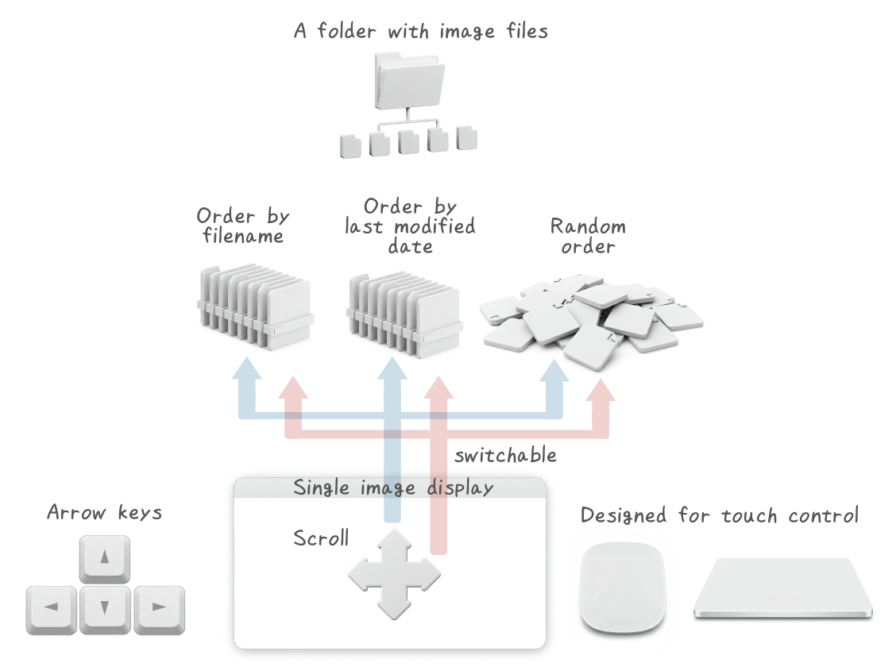

Yee 3
======

The Minimalist Image Viewer.
Sleek and fast.


[Xee 3](https://theunarchiver.com/xee) lacks Apple Silicon support and struggles with some image formats, so I first built this with ChatGPT (o3-mini-high), and have continued evolving it with Codex CLI and whichever latest model was available at the time.

Designed for macOS.
half-hearted Windows support.

Concept and design
----------------



Yee 3 is designed as a single-image viewer for very large folders.

It prioritizes rapid image swapping over thumbnail browsing, treating scrolling and touch-friendly input as primary navigation methods while also supporting precise keyboard control.

Its single-image view can be explored through independent vertical and horizontal orders, with each axis freely switchable between last-modified order, filename order, and random order.

Even with huge folders on SSDs, HDDs, or slower storage such as NAS, the aim is to keep browsing fluid and uninterrupted.

How to build an app on your local Mac
------------------------------------

- **Setup the environment**
    - `pip3 install pdm`
    - `pdm install --dev`  *(Run again if `pyproject.toml` or `pdm.lock` changes.)*
- **Build**

```sh
iconutil -c icns src/yee3/resources/yee3.iconset
pdm run briefcase build macOS
cp ./Info.plist build/yee3/macos/app/Yee\ 3.app/Contents/.
```

Used via Automator (without build)
----------------------------------

Use Automator for quick app wrapping.

- `Run Shell Script`
- Shell: `/bin/zsh`
- Pass input: `as arguments`

```
set -euo pipefail
# pip3 install PyQt5
python3 ${YEE3_SCRIPT_PATH}/src/yee3/app.py "$@"
```

Please either modify or configure the YEE3_SCRIPT_PATH part.
