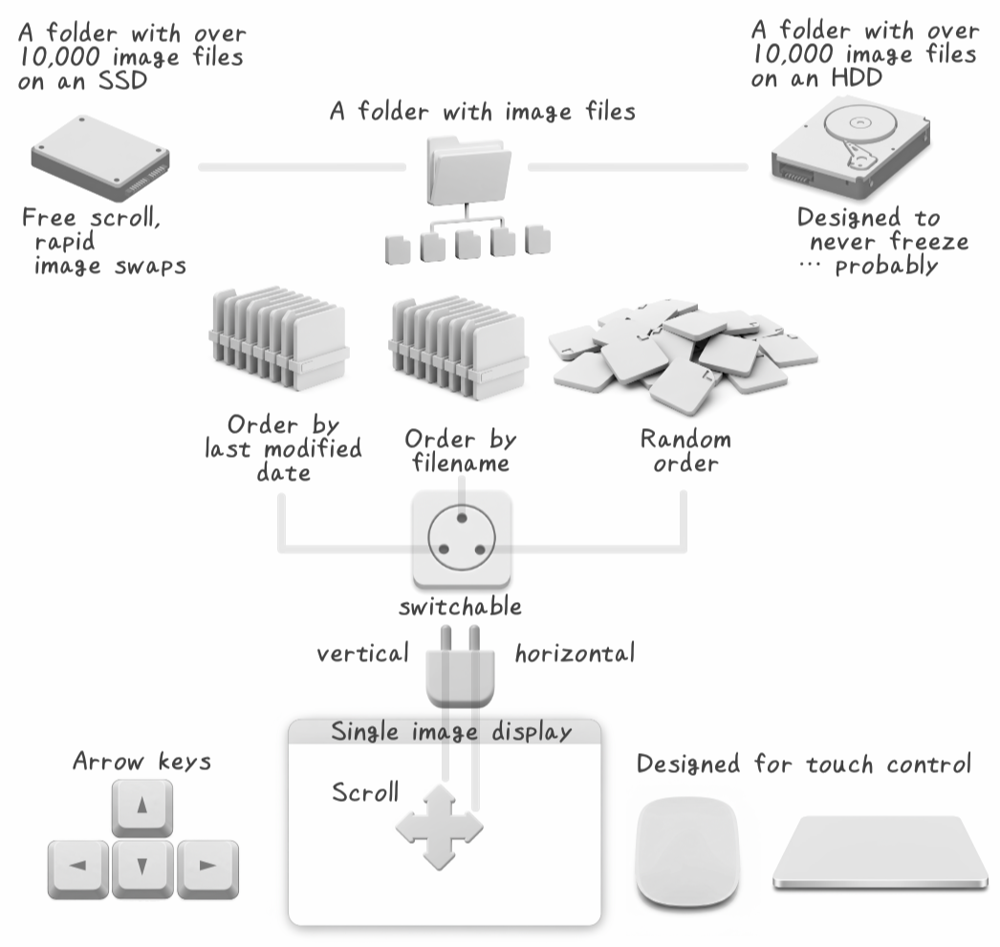

Yee 3
======

The Minimalist Image Viewer.
Sleek and fast.


[Xee 3](https://theunarchiver.com/xee) lacks Apple Silicon support and struggles with some image formats, so I built this with ChatGPT (o3-mini-high).

Designed for macOS.

🔔 It’s better **not** to proceed with `Open With` → `Change All…` just yet.

Concept and design
----------------



How to build an app on your local Mac
------------------------------------

- **Setup the environment**
    - `pip3 install pdm`
    - `pdm install --dev`  *(Run again if `pyproject.toml` or `pdm.lock` changes.)*
- **Build**
    - `iconutil -c icns src/yee3/resources/yee3.iconset`
    - `pdm run briefcase build macOS`
    - `patch -u < Info.plist.patch`


Used via Automator (without build)
----------------------------------

Use Automator for quick app wrapping.

- `Run Shell Script`
- Shell: `/bin/zsh`
- Pass input: `as arguments`

```
set -euo pipefail
# pip3 install PyQt5
python3 ${YEE3_SCRIPT_PATH}/src/yee3/app.py "$@"
```

Please either modify or configure the YEE3_SCRIPT_PATH part.
