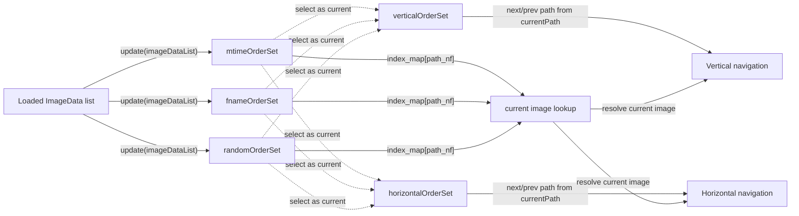
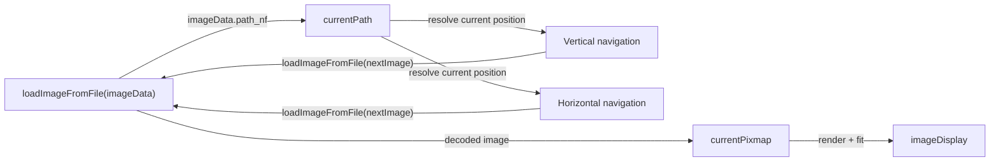

# Spec

This document describes the core viewing model of Yee3.
It focuses on how the app organizes image order, how navigation chooses the next image, and how the currently displayed image is represented in memory.
It does not attempt to document every UI control, file operation detail, or platform-specific behavior.

The highest-priority requirement is performance on folders containing tens of thousands of images.
Both initial loading and next/previous image navigation must remain fast enough to feel immediate in practical use.
This requirement also applies to slower or higher-latency storage such as NAS and network shares.
The design should prefer algorithms and data flow that perform well across both local and remote storage, rather than relying on storage-specific branching whenever possible.
Lazy or incremental loading must not materially degrade the interaction model.
During loading, navigation and order switching should remain available without feature loss, blocked states, or "wait until loading finishes" compromises in normal use.

## Scope And Terms

Terms used in this document:

- `ImageData`: the minimal metadata record used for navigation
- `OrderSet`: a conceptual label for one ordered collection of `ImageData`
- `currentPath`: the identity of the currently displayed image
- `currentPixmap`: the in-memory image source used for display and scale calculations

## Order Model

Yee3 does not treat a folder as a thumbnail grid or a tree browser.
It treats a folder as one image set with multiple possible orders.
This model is chosen to preserve both fast initial loading and fast image-to-image navigation at large folder sizes.

Base order sets:
- `mtimeOrderSet`: newest-first order by file modified time
- `fnameOrderSet`: lexical order by file name
- `randomOrderSet`: stable pseudo-random order

Active navigation bindings:
- `verticalOrderSet`: the order currently assigned to vertical navigation
- `horizontalOrderSet`: the order currently assigned to horizontal navigation

The important point is that vertical and horizontal navigation do not read all order sets at once.
Each direction uses exactly one currently selected order.

## Current Image State

The currently displayed image is represented by two different kinds of state.

- `currentPath`: the identity of the currently displayed image
- `currentPixmap`: the decoded base image used for rendering and scale calculations

`currentPath` is used to resolve the current image and its next/previous path in the active order.
`currentPixmap` is used as the image source for display and fitting.
Navigation loads the next `ImageData`, then rewrites both states through `loadImageFromFile(imageData)`.

## Complexity Constraints

Let `N` be the number of images in one folder image set.

Operation bounds:
- Scanning one folder for supported files: `O(N)` metadata discovery
- Building one order from known image metadata: currently `O(N^2)` in the incremental implementation, but should move toward `O(N log N)`
- Building maintained orders should avoid unnecessary extra `O(N^2)` behavior beyond ordered insertion itself
- Resolve the current image in an active order: `O(1)`
- Next/previous navigation within an active order: `O(1)` target, and must not scale linearly with `N`
- Switching the vertical or horizontal active order binding: `O(1)`

The current implementation still pays its largest cost during incremental order construction.
That cost is tolerated for now because the viewer must preserve globally ordered navigation without dropping functionality during loading, but future changes should reduce it rather than add new linear work to hot paths.
